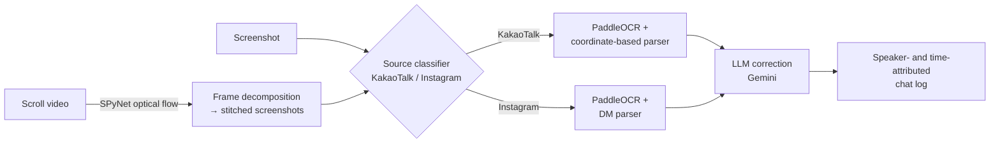
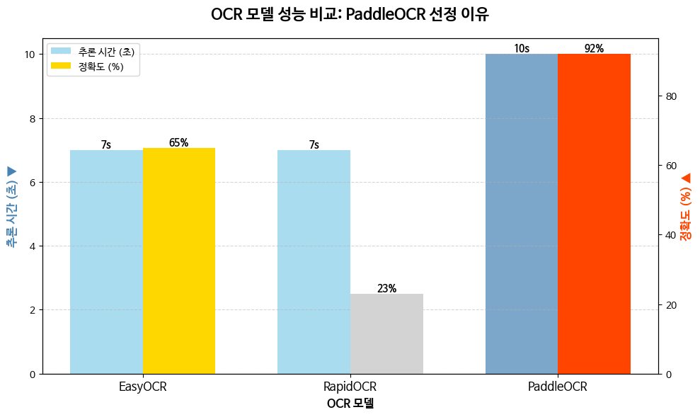

# oTP — Chat-log OCR pipeline (experiment notebooks)

This is the **experiment/research notebook repo** for the oTP project (GDGoC Yonsei). The deployed Modal OCR service lives at [2022148084/otp-ai](https://github.com/2022148084/otp-ai) — this repo holds the Colab notebooks where the pipeline was prototyped and the OCR engines were compared.

## Repository structure

```
notebooks/            # the original Colab experiments (chronological table below)
src/otp_ocr/          # the same code extracted into importable modules
  kakao.py            #   coordinate-based KakaoTalk parser (kakao_parser_easyocr.ipynb)
  insta.py            #   Instagram DM parser (insta_dm_parser_paddle.ipynb)
  engines.py          #   EasyOCR / PaddleOCR / RapidOCR wrappers
  scroll_video.py     #   SPyNet scroll-video frame extraction
  gemini_correction.py#   Vertex AI Gemini OCR post-correction
scripts/              # thin argparse CLIs over src/ (parse_kakao, parse_insta, extract_frames)
assets/               # comparison chart
docs/                 # strategy.md (design rationale), README.ko.md (Korean-language notes)
```

The notebooks are the original Colab experiments; `src/` is the same code extracted into importable modules (no functional changes). The source-classification router (`insta_kakao_sort.parse_which`, imported by `notebooks/img_to_text.ipynb`) was never saved as a `.py` file and is not defined in any notebook — it lives in the separate [kakao_insta_detector](https://github.com/YeeDEA/kakao_insta_detector) repo, so it is not part of `src/`.

## Problem

Given a KakaoTalk or Instagram DM **screenshot** — or a **scroll-recording video** of a chat — reconstruct the conversation as a structured chat log with **speaker and timestamp attribution**. Korean chat UIs make this harder than plain OCR: speaker identity is encoded in bubble position (left/right) and avatar layout, timestamps sit in small side labels, and Korean text recognition quality varies a lot between engines.

## Design intent

The project's own framing (see [docs/strategy.md](docs/strategy.md), summarized from the team strategy deck) is
that the deliverable is a **conversion**: an unstructured capture image in, a chronologically ordered structured
chat log out. Three consequences shape the architecture:

- **Structure comes from layout, not from language.** OCR is only asked to return text and boxes; speaker identity,
  turn boundaries, and time ordering are all reconstructed afterward from coordinates. That is why the engine
  choice and the parser are independent decisions here.
- **Noise is removed twice, for two different reasons.** *Geometric* noise — the static header band (chat-room
  info, notice banner) — is excluded by restricting the region of interest before parsing. *Semantic* noise —
  system messages like join/leave/invite notices, deleted-message markers, UI button labels — is filtered by
  content afterward. Collapsing these into one step loses the header, which has no distinguishing text.
- **Turn reconstruction is stateful.** Consecutive lines from the same speaker are not separate records; the parser
  keeps an open turn and closes it when a timestamp line appears, so multi-line messages survive intact.

The deck's own stage list is: input → preprocessing (UI removal, ROI) → filtering (system messages) → analysis
(speaker identification, consecutive-utterance state management) → output (time-ordered conversation data). The
deck covers the KakaoTalk screenshot path only; the video input, the Instagram parser, the LLM correction pass, and
the engine comparison below are notebook-derived additions.

## Pipeline

Deck's stage structure, as presented:

```
[Input]          conversation capture image
     |
[Preprocessing]  UI removal + ROI segmentation   (static header / notice banner excluded)
     |
[Filtering]      drop system messages & UI noise
     |
[Analysis]       speaker identification + consecutive-utterance state management
     |
[Output]         chronologically ordered conversation data
```

As implemented in this repo, with the video path and source routing:



- **Source classification** (KakaoTalk vs Instagram) is a MobileNetV2 classifier developed in a separate repo: [kakao_insta_detector](https://github.com/YeeDEA/kakao_insta_detector).
- **Parsing** uses OCR box coordinates: bubbles left/right of the image center X assign speaker turns; small side labels are matched to timestamps. On the left side, a short leading line is treated as a sender name rather than message text. Before that, a first pass raises the ROI start line past any left-anchored notice/banner box near the top, and a content filter drops system messages, UI labels, and quoted-reply blocks.
- **Videos** are decomposed with SPyNet optical flow — scroll displacement between frames decides when a new "screenshot" is captured (in the recorded run, 348 frame pairs collapsed into 4 stitched screenshots, ~5–8 s per pair on CPU).
- **LLM correction**: a Gemini pass fixes character-level OCR errors while preserving the timestamp/speaker structure.

## OCR engine comparison

Four engines were considered — **EasyOCR**, **RapidOCR**, **PaddleOCR**, **Pororo** — but they were not eliminated for the same kind of reason, and the difference matters when reading the table below.

**Pororo was ruled out at install time, not on quality.** `pip install pororo` could not resolve in the Colab environment: every published version from 0.3.1 to 0.4.2 pins `torch==1.6.0`, pip walked all eight of them, and the resolve ended in `ResolutionImpossible`. The attempt and its full pip error log are kept in [`notebooks/pororo_install_failed.ipynb`](notebooks/pororo_install_failed.ipynb) — the next cell, which would have called `Pororo(task="ocr", lang="ko")`, was never executed. **There is therefore no accuracy or speed measurement for Pororo anywhere in this project, and none should be inferred.** It was dropped because its dependency pin could not be satisfied in the runtime available, which is a fact about the library's packaging rather than a finding about its Korean OCR quality.

The remaining three were actually run and scored against each other on Korean chat screenshots, in `notebooks/ocr_engine_comparison.ipynb`:



| Engine | Inference time | Accuracy on test screenshots |
|---|---|---|
| EasyOCR | ~7 s | 65% |
| RapidOCR | ~7 s | 23% |
| **PaddleOCR** | ~10 s | **92%** |

These are small-sample, hand-tallied numbers from the project's own test screenshots (line-level correctness), not a benchmark — but the gap was decisive. RapidOCR in particular mangled Korean bubbles into garbage strings at high confidence (see `notebooks/rapidocr_test.ipynb`), and EasyOCR needed an extra LLM-correction pass to be usable. **PaddleOCR (korean_PP-OCRv5) was chosen**, then sped up in `notebooks/paddleocr_speed_test.ipynb` (MKL-DNN, input resizing).

## Notebooks (chronological — the experiment sequence is the narrative, under `notebooks/`)

| Notebook | Date | What happened |
|---|---|---|
| `kakao_ocr_easyocr_early_experiment.ipynb` | 2025-11-16 | First attempt: EasyOCR on a KakaoTalk screenshot, naive column-split parsing. Timestamps like `01:75` show why raw OCR wasn't enough. |
| `kakao_ocr_paddle_chatlog.ipynb` | 2025-11-17 | PaddleOCR (korean_PP-OCRv5) → full screenshot-to-chatlog conversion. First convincing end-to-end result. |
| `kakao_ocr_easyocr_gemini_correction.ipynb` | 2025-11-25 | EasyOCR output post-corrected with Gemini (Vertex AI) — patching a weak engine with an LLM. |
| `pororo_install_failed.ipynb` | 2025-11-25 | Pororo OCR attempt. `pip install pororo` ended in `ResolutionImpossible` — all 8 published versions pin `torch==1.6.0`. Never ran; the only record that Pororo was tried at all. |
| `rapidocr_test.ipynb` | 2025-11-27 | RapidOCR trial on Korean chat text. Failed badly (confidently wrong strings); ruled out. |
| `kakao_parser_easyocr.ipynb` | 2025-11-30 | EasyOCR-based KakaoTalk parser refactored into a module. |
| `spynet_scroll_video_pipeline.ipynb` | 2025-11-30 | SPyNet optical-flow decomposition of scroll videos into screenshots, then OCR + parsing. |
| `insta_dm_parser_paddle.ipynb` | 2025-11-30 | Instagram DM layout parser on top of PaddleOCR. |
| `img_to_text.ipynb` | 2025-11-30 | Main entry point draft: route to the Kakao or Instagram parser after source classification. |
| `paddleocr_speed_test.ipynb` | 2025-12-02 | PaddleOCR speed work (MKL-DNN, resizing) + coordinate-based KakaoTalk parser. |
| `ocr_engine_comparison.ipynb` | 2025-12-03 | The comparison chart above — the written-down basis for choosing PaddleOCR. |

Work period: Nov 16 – Dec 3, 2025. These were Colab notebooks, organized and renamed afterward; the original-filename mapping is kept in [docs/README.ko.md](docs/README.ko.md).

## Running the notebooks

Everything is Colab-oriented (each notebook installs its own dependencies in the first cell). To run locally:

```bash
pip install -r requirements.txt
```

Then point a notebook at your own screenshot (paths like `image.png` / `Test_Dataset/Test_image.jpg` in the cells). The SPyNet pipeline expects the `network-sintel-final` weights under `weights/spynet/`. Output cells that contained real conversations have been cleared for privacy — supply your own test images.

## Related repos

- [2022148084/otp-ai](https://github.com/2022148084/otp-ai) — the deployed Modal OCR service (team deploy repo)
- [YeeDEA/kakao_insta_detector](https://github.com/YeeDEA/kakao_insta_detector) — MobileNetV2 KakaoTalk/Instagram source classifier (the router in the diagram)

## Limitations & status

- Notebook-stage experiments — no packaged library or tests; the productionized version is the Modal service linked above.
- The engine comparison is informal (a handful of screenshots, hand-scored line accuracy), enough to pick an engine but not a benchmark. It also covers three engines, not four: Pororo failed to install and was never measured.
- Parsing heuristics are tuned to specific KakaoTalk/Instagram layouts and resolutions; UI updates can break the coordinate rules.
- Timestamp OCR remains the weakest link (colon/digit confusions), partially recovered by the LLM correction pass.
- The oTP project received the popularity award at the GDGoC Yonsei December 2025 demo.

## License

MIT — see [LICENSE](LICENSE).
