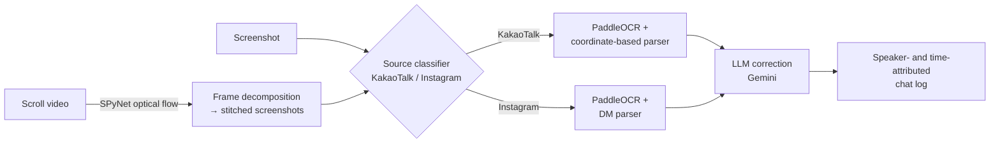

# oTP — chat screenshots into structured chat logs

oTP reconstructs a KakaoTalk or Instagram DM conversation — from a screenshot, or from a scroll-recording video — as a chat log with speaker and timestamp attribution. This repository holds the Colab notebooks where that pipeline was prototyped and its OCR engine was chosen.

*Work period: Nov 16 – Dec 3, 2025, in Google Colab. Published here Aug 2026, when those notebooks were reorganized into this repository — so the git history starts at that import, not at the work. File-by-file mapping in [Provenance](#file-provenance).*

## What we were solving

oTP was a GDGoC Yonsei club project, and it took the **popularity award at the December 2025 demo**.

The problem it addresses looks like plain OCR and isn't. A chat screenshot carries most of its meaning in layout rather than in text: who said something is encoded in whether the bubble sits left or right of center and in how the avatar is placed, when they said it is a small side label rather than part of the message, and the boundary between one message and the next is a visual gap. Feed that image to an OCR engine and you get back a bag of strings — correct characters, destroyed conversation. Korean makes it harder still, because recognition quality on Korean chat text varies enormously from engine to engine.

So the deliverable was never "text out of an image". It was a **conversion**: unstructured capture in, chronologically ordered structured chat log out.

## Choosing the OCR engine

The decision that shaped everything downstream was which recognizer to build on. Four candidates went in — **EasyOCR**, **RapidOCR**, **PaddleOCR**, **Pororo** — but only three came out with numbers, and the difference in *why* matters.

**Pororo never ran.** `pip install pororo` could not resolve in the Colab environment: every published version from 0.3.1 to 0.4.2 pins `torch==1.6.0`, pip walked all eight of them, and the resolve ended in `ResolutionImpossible`. The attempt and its full pip error log are kept in [`notebooks/pororo_install_failed.ipynb`](notebooks/pororo_install_failed.ipynb); the next cell, which would have called `Pororo(task="ocr", lang="ko")`, was never executed. **There is therefore no accuracy or speed measurement for Pororo anywhere in this project, and none should be inferred.** It was dropped because its dependency pin could not be satisfied in the runtime available — a fact about the library's packaging, not a finding about its Korean OCR quality. We kept the failed notebook precisely so that distinction survives.

The other three were actually run and scored against each other on Korean chat screenshots, in `notebooks/ocr_engine_comparison.ipynb`:


| Engine | Inference time | Accuracy on test screenshots |
|---|---|---|
| EasyOCR | ~7 s | 65% |
| RapidOCR | ~7 s | 23% |
| **PaddleOCR** | ~10 s | **92%** |

These are small-sample, hand-tallied numbers from the project's own test screenshots (line-level correctness), not a benchmark — but the gap was decisive. RapidOCR in particular mangled Korean bubbles into garbage strings at high confidence (see `notebooks/rapidocr_test.ipynb`), which is the worst failure mode available, since nothing downstream can tell that it went wrong. EasyOCR was usable but needed an extra LLM-correction pass to get there. **PaddleOCR (korean_PP-OCRv5) was chosen** — the slowest of the three, and the trade was worth it — then sped up in `notebooks/paddleocr_speed_test.ipynb` through MKL-DNN and input resizing.

## Running the notebooks

Everything is Colab-oriented — each notebook installs its own dependencies in the first cell. To run locally:

```bash
pip install -r requirements.txt
```

Then point a notebook at your own screenshot (the cells use paths like `image.png` / `Test_Dataset/Test_image.jpg`). Output cells that contained real conversations have been cleared for privacy, so you need to supply your own test images. The SPyNet pipeline additionally expects the `network-sintel-final` weights under `weights/spynet/`.

The same three entry points exist as command-line scripts over `src/`:

```bash
python scripts/parse_kakao.py path/to/kakao.png      # screenshot -> chat log (EasyOCR + coordinate parser)
python scripts/parse_insta.py path/to/insta_dm.png   # Instagram DM -> chat log (PaddleOCR)
python scripts/extract_frames.py path/to/scroll.mp4  # scroll video -> stitched screenshots (SPyNet)
```

## How the pipeline fits together

The team strategy deck lays the system out as five stages:

```
[Input]          conversation capture image
     |
[Preprocessing]  UI removal + ROI segmentation   (static header / notice banner excluded)
     |
[Filtering]      drop system messages & UI noise
     |
[Analysis]       speaker identification + consecutive-utterance state management
     |
[Output]         chronologically ordered conversation data
```

What the notebooks actually implement is that skeleton plus a video path and a source router:



Reading that left to right: a scroll recording is decomposed with SPyNet optical flow, where scroll displacement between frames decides when a new "screenshot" has been reached — in the recorded run, 348 frame pairs collapsed into 4 stitched screenshots, at roughly 5–8 s per pair on CPU. Screenshots (captured or stitched) hit a source classifier that decides KakaoTalk versus Instagram; that classifier is a MobileNetV2 model developed in a separate repository, [kakao_insta_detector](https://github.com/YeeDEA/kakao_insta_detector).

Parsing then works entirely from OCR box coordinates. Bubbles to the left or right of the image center X assign speaker turns, and small side labels are matched to timestamps. On the left side, a short leading line is treated as a sender name rather than message text. Before any of that, a first pass raises the ROI start line past any left-anchored notice or banner box near the top, and a content filter drops system messages, UI labels, and quoted-reply blocks. Finally a Gemini pass corrects character-level OCR errors while preserving the timestamp and speaker structure it was handed.

## The thinking behind the architecture

The design rationale is written up in [docs/strategy.md](docs/strategy.md), summarized from the team strategy deck. Three ideas from it explain why the code is shaped the way it is.

**Structure comes from layout, not from language.** OCR is only ever asked to return text and boxes. Speaker identity, turn boundaries, and time ordering are all reconstructed afterward from coordinates. That separation is what made the engine swap in the section above a cheap experiment rather than a rewrite — the engine choice and the parser are independent decisions here.

**Noise is removed twice, for two different reasons.** *Geometric* noise — the static header band with chat-room info and the notice banner — is excluded by restricting the region of interest before parsing. *Semantic* noise — system messages like join/leave/invite notices, deleted-message markers, UI button labels — is filtered by content afterward. It is tempting to collapse these into one filtering step, and doing so loses the header, which has no distinguishing text to filter on.

**Turn reconstruction is stateful.** Consecutive lines from the same speaker are not separate records; the parser keeps an open turn and closes it when a timestamp line appears, so multi-line messages survive intact.

One scoping note: the deck covers the KakaoTalk screenshot path only. The video input, the Instagram parser, the LLM correction pass, and the engine comparison above are all notebook-derived additions rather than deck-derived.

## The experiments, in the order they happened

The sequence is the narrative — everything below lives under `notebooks/`.

**2025-11-16 · `kakao_ocr_easyocr_early_experiment.ipynb`** — First attempt: EasyOCR on a KakaoTalk screenshot, naive column-split parsing. Timestamps like `01:75` show why raw OCR wasn't enough.

**2025-11-17 · `kakao_ocr_paddle_chatlog.ipynb`** — PaddleOCR (korean_PP-OCRv5) → full screenshot-to-chatlog conversion. First convincing end-to-end result.

**2025-11-25 · `kakao_ocr_easyocr_gemini_correction.ipynb`** — EasyOCR output post-corrected with Gemini (Vertex AI) — patching a weak engine with an LLM.

**2025-11-25 · `pororo_install_failed.ipynb`** — Pororo OCR attempt. `pip install pororo` ended in `ResolutionImpossible` — all 8 published versions pin `torch==1.6.0`. Never ran; the only record that Pororo was tried at all.

**2025-11-27 · `rapidocr_test.ipynb`** — RapidOCR trial on Korean chat text. Failed badly (confidently wrong strings); ruled out.

**2025-11-30 · `kakao_parser_easyocr.ipynb`** — EasyOCR-based KakaoTalk parser refactored into a module.

**2025-11-30 · `spynet_scroll_video_pipeline.ipynb`** — SPyNet optical-flow decomposition of scroll videos into screenshots, then OCR + parsing.

**2025-11-30 · `insta_dm_parser_paddle.ipynb`** — Instagram DM layout parser on top of PaddleOCR.

**2025-11-30 · `img_to_text.ipynb`** — Main entry point draft: route to the Kakao or Instagram parser after source classification.

**2025-12-02 · `paddleocr_speed_test.ipynb`** — PaddleOCR speed work (MKL-DNN, resizing) + coordinate-based KakaoTalk parser.

**2025-12-03 · `ocr_engine_comparison.ipynb`** — The comparison chart above — the written-down basis for choosing PaddleOCR.

## What's in this repository

```
notebooks/            # the original Colab experiments (chronological list above)
src/otp_ocr/          # the same code extracted into importable modules
  kakao.py            #   coordinate-based KakaoTalk parser (kakao_parser_easyocr.ipynb)
  insta.py            #   Instagram DM parser (insta_dm_parser_paddle.ipynb)
  engines.py          #   EasyOCR / PaddleOCR / RapidOCR wrappers
  scroll_video.py     #   SPyNet scroll-video frame extraction
  gemini_correction.py#   Vertex AI Gemini OCR post-correction
scripts/              # thin argparse CLIs over src/ (parse_kakao, parse_insta, extract_frames)
assets/               # comparison chart
docs/                 # strategy.md (design rationale), README.ko.md (Korean-language notes)
```

The notebooks are the original Colab experiments; `src/` is the same code extracted into importable modules (no functional changes).

One piece is missing by circumstance rather than by design: the source-classification router (`insta_kakao_sort.parse_which`, imported by `notebooks/img_to_text.ipynb`) was never saved as a `.py` file and is not defined in any notebook. It lives in the separate [kakao_insta_detector](https://github.com/YeeDEA/kakao_insta_detector) repo, so it is not part of `src/`.

## Related repositories

This is the **experiment/research notebook repo** for oTP. The deployed Modal OCR service lives at [2022148084/otp-ai](https://github.com/2022148084/otp-ai) — this repo is where the pipeline was prototyped and the OCR engines were compared.

- [2022148084/otp-ai](https://github.com/2022148084/otp-ai) — the deployed Modal OCR service (team deploy repo)
- [YeeDEA/kakao_insta_detector](https://github.com/YeeDEA/kakao_insta_detector) — MobileNetV2 KakaoTalk/Instagram source classifier (the router in the diagram)

## File provenance

These were Colab notebooks, organized and renamed afterward; the original-filename mapping is also kept in [docs/README.ko.md](docs/README.ko.md).

- `kakao_ocr_easyocr_early_experiment.ipynb` ← `B/Untitled6.ipynb` (2025-11-16)
- `kakao_ocr_paddle_chatlog.ipynb` ← `A/Untitled15.ipynb` (2025-11-17)
- `kakao_ocr_easyocr_gemini_correction.ipynb` ← `A/Untitled16.ipynb` (2025-11-25)
- `pororo_install_failed.ipynb` ← `A/Untitled19.ipynb` (2025-11-25)
- `rapidocr_test.ipynb` ← same name (2025-11-27)
- `kakao_parser_easyocr.ipynb` ← `A/Untitled22.ipynb` (2025-11-30)
- `spynet_scroll_video_pipeline.ipynb` ← `A/Untitled23.ipynb` (2025-11-30)
- `insta_dm_parser_paddle.ipynb` ← `A/Untitled24.ipynb` (2025-11-30)
- `img_to_text.ipynb` ← same name (2025-11-30)
- `paddleocr_speed_test.ipynb` ← same name (2025-12-02)
- `ocr_engine_comparison.ipynb` ← `A/Untitled26.ipynb` (2025-12-03)

## Where it falls short

- These are notebook-stage experiments — no packaged library, no tests. The productionized version is the Modal service linked above.
- The engine comparison is informal: a handful of screenshots, hand-scored line accuracy. Enough to pick an engine, not enough to call a benchmark. It also covers three engines, not four — Pororo failed to install and was never measured.
- Parsing heuristics are tuned to specific KakaoTalk and Instagram layouts and resolutions. A UI update can break the coordinate rules outright.
- Timestamp OCR remains the weakest link (colon/digit confusions), only partially recovered by the LLM correction pass.

## License

MIT — see [LICENSE](LICENSE).
